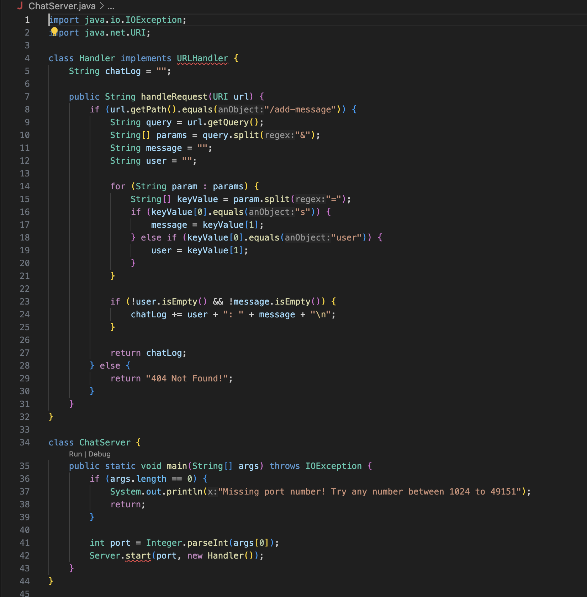
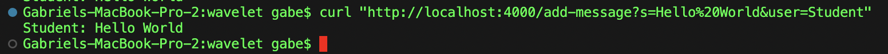
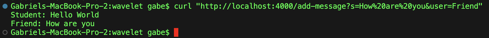
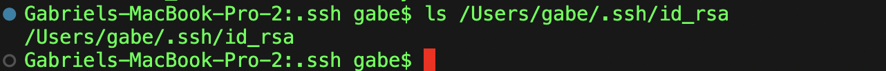
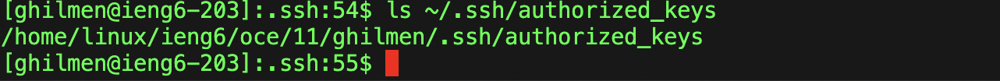
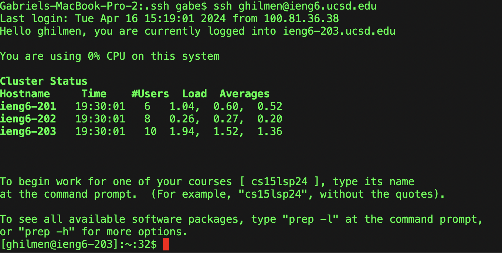

# Lab 2 CSE15L

## Part 1

ChatServer code:

First curl request:

* `urlHandler` method was called from the `curl` request
* The Argument passed from the curl command is a `url` with a query
* The relevent fields that change is the `chatLog`, which is the string that represents the history of what we have already passed with `/add-message`.

Second curl request:

* `urlHandler` method was called from the `curl` request
* The Argument passed from the curl command is a `url` with a query
* The relevent fields that change is the `chatLog`, which is the string that represents the history of what we have already passed with `/add-message`. Now `chatLog` is a string containing both of the messages we have stored using `curl`.

## Part 2

`ls` with absolute path to private key:

`ls` with absolute path to public key on ieng6

Screenshot of using `ssh` without being prompted for a password

