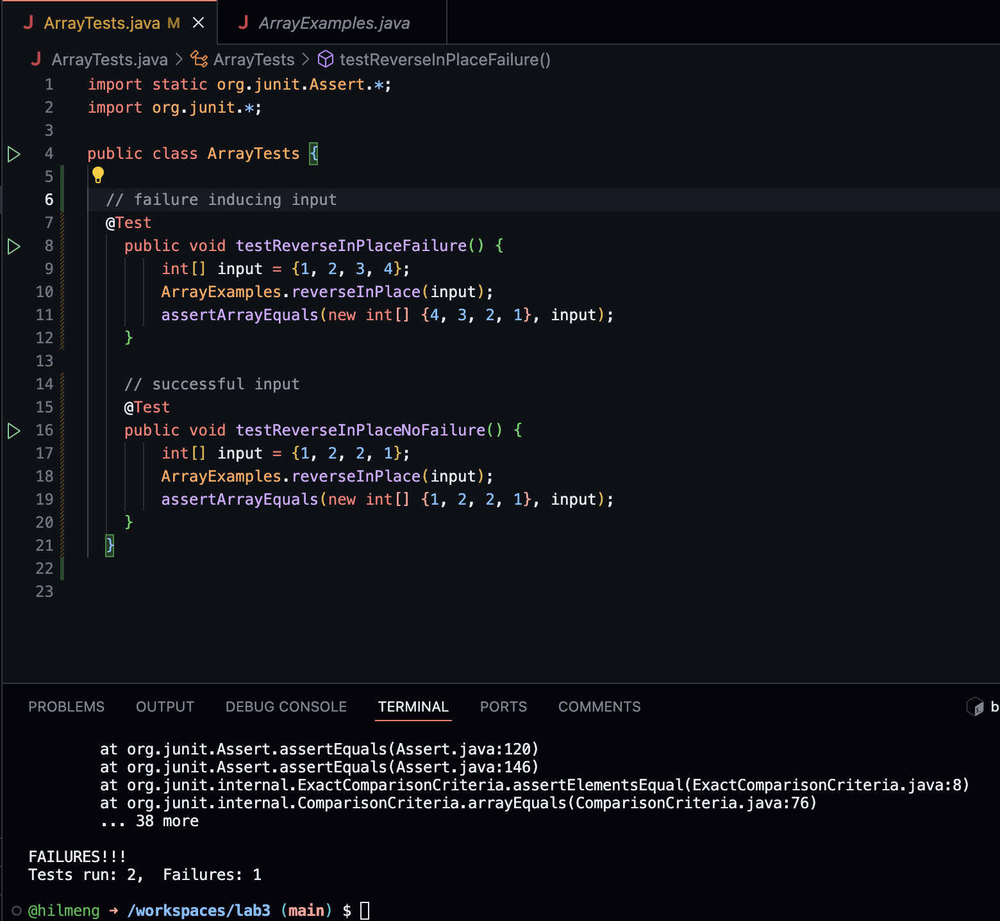

# CSE 15L Lab 3

## Part 1:

### Code:

For part one I chose to use this method:
```
// Changes the input array to be in reversed order
  static void reverseInPlace(int[] arr) {
    for(int i = 0; i < arr.length; i += 1) {
      arr[i] = arr[arr.length - i - 1];
    }
  }
```

### Failure-inducing input:

```
@Test
    public void testReverseInPlaceFailure() {
        int[] input = {1, 2, 3, 4};
        ArrayExamples.reverseInPlace(input);
        assertArrayEquals(new int[] {4, 3, 2, 1}, input);
    }
```

### Non-failure-inducing input:

```
@Test
    public void testReverseInPlaceNoFailure() {
        int[] input = {1, 2, 2, 1};
        ArrayExamples.reverseInPlace(input);
        assertArrayEquals(new int[] {1, 2, 2, 1}, input);
    }
```

### Symptom



### Fixing the bug

Before:
```
// Changes the input array to be in reversed order
  static void reverseInPlace(int[] arr) {
    for(int i = 0; i < arr.length; i += 1) {
      arr[i] = arr[arr.length - i - 1];
    }
  }
```

After:
```
static void reverseInPlace(int[] arr) {
    for(int i = 0; i < arr.length / 2; i += 1) {
        int temp = arr[i];
        arr[i] = arr[arr.length - i - 1];
        arr[arr.length - i - 1] = temp;
    }
}

```

The changes that were made fixed the issue where the code was copying itself. To fix this, I made a new temp array to hold the value of one element during the swap, thus preserving the data. Additionall, by only iterating up to the middle of the array, the method can ensure that each element was only swapped once, instead of twice.

## Part 2:

Note: I used the [grep man page](https://linuxcommand.org/lc3_man_pages/grep1.html) as my source for all of the examples

I chose the `grep` command, and will be using the flags `-i` (ignore case), `-r` (recursive), `-v` (invert match), and `n` (line number).

### `-i` flag

**Example 1:**
```
gabe@Gabriels-MacBook-Pro-2 technical % grep -i "housing" /Users/gabe/Desktop/technical/biomed/*.xml

/Users/gabe/Desktop/technical/biomed/1471-2156-2-12-hepple.xml:            <f name="base" value="housing"/>
/Users/gabe/Desktop/technical/biomed/1471-2164-3-35-hepple.xml:            <f name="base" value="housing"/>
/Users/gabe/Desktop/technical/biomed/1471-2202-4-12-hepple.xml:            <f name="base" value="housing"/>
/Users/gabe/Desktop/technical/biomed/1471-2202-4-12-hepple.xml:            <f name="base" value="housing"/>
/Users/gabe/Desktop/technical/biomed/1471-2202-4-12-hepple.xml:            <f name="base" value="housing"/>
/Users/gabe/Desktop/technical/biomed/1471-2202-4-12-hepple.xml:            <f name="base" value="housing"/>
```
This example checked all `.xml` files in the `/biomed` directory for the string `"housing"`. This is useful for searching for words when you don't exactly know which cases to search for or if you don't care about them, so it ignores things like "Reference" or "REFERENCE." It went on for a long time so I cut it off after the first few lines so it didn't end up being 5 pages.

**Example 2:**
```
gabe@Gabriels-MacBook-Pro-2 technical % grep -ir "sample" /Users/gabe/Desktop/technical/911report/

/Users/gabe/Desktop/technical/911report//chapter-13.5.txt:                dust samples collected before September 18 showed the presence of asbestos above the
/Users/gabe/Desktop/technical/911report//chapter-3.txt:                INITIAL ASSAULTS 117 that a soil sample from the vicinity of the al Shifa plant had
/Users/gabe/Desktop/technical/911report//chapter-3.txt:                that their judgment was right, pointing to the soil sample evidence. No independent
/Users/gabe/Desktop/technical/911report//chapter-13.5-hepple.xml:            <f name="base" value="sample"/>
/Users/gabe/Desktop/technical/911report//chapter-13.5-hepple.xml:            <f name="base" value="sample"/>
/Users/gabe/Desktop/technical/911report//chapter-3-hepple.xml:            <f name="base" value="sample"/>
/Users/gabe/Desktop/technical/911report//chapter-3-hepple.xml:            <f name="base" value="sample"/>
gabe@Gabriels-MacBook-Pro-2 technical % 
```
This example used checked for the string `"sample"` within all `.xml` files of `/911report`, again ignoring case. This is useful for finding speciic samples mentioned in multiple files.

### `-r` flag

**Example 1:**
```
gabe@Gabriels-MacBook-Pro-2 technical % grep -r "dataset" /Users/gabe/Desktop/technical/plos/     

/Users/gabe/Desktop/technical/plos//pmed.0020059.txt:          Data are verified for completeness and accuracy, concatenated into a single dataset,
/Users/gabe/Desktop/technical/plos//pmed.0020059.txt:          spatial and temporal attributes of each case in the dataset. That is, we shuffle the
/Users/gabe/Desktop/technical/plos//pmed.0020059.txt:          calculated for each simulated dataset in exactly the same way as for the real data.
/Users/gabe/Desktop/technical/plos//pmed.0020059.txt:          example, the maximum GLR is calculated from 999 simulated datasets, and the maximum GLR
```
This example uses `-r` to recursively search for the string `"dataset"` within the `/plos` directory, useful for searching all files within a specific directory. Again I did not copy the full output to save space.

**Example 2:**
```
gabe@Gabriels-MacBook-Pro-2 technical % grep -r "<title>" /Users/gabe/Desktop/technical/plos/

/Users/gabe/Desktop/technical/plos//pmed.0020237.anc:            <title>pmed.0020237</title>
/Users/gabe/Desktop/technical/plos//pmed.0020237.anc:            <title>Targeting of a Host Protein to Suppress Hepatitis B Virus Replication</title>
/Users/gabe/Desktop/technical/plos//journal.pbio.0030076.anc:            <title>journal.pbio.0030076</title>
/Users/gabe/Desktop/technical/plos//journal.pbio.0030076.anc:            <title>A New Paradigm in Eukaryotic Biology: HIV Tat and the Control of Transcriptional Elongation</title>
```
Here I used `-r` to search for the `<title>` tag in the folder `/plos`. This is useful because with structured files like `.xml` files, they have tags that we can search for to find specific data. The full output was cut off for space.

### `-v` flag

**Example 1:**
```
gabe@Gabriels-MacBook-Pro-2 technical % grep -v "<author>" /Users/gabe/Desktop/technical/biomed/1468-6708-3-1-hepple.xml
<?xml version="1.0" encoding="UTF-8"?>
<graph xmlns="http://www.xces.org/ns/GrAF/1.0/">
    <header>
        <tagsDecl>
            <tagUsage gi="tok" occurs="3946"/>
        </tagsDecl>
        <annotationSets>
            <annotationSet name="xces" type="http://www.xces.org/schema/2003"/>
        </annotationSets>
    </header>
    <region xml:id="penn-r0" anchors="24 36"/>
    <node xml:id="penn-n0">
        <link targets="penn-r0"/>
```
For this example `-v` was used on the specific `.xml` file in `/biomed` to search for all lines that do not contain the `"<author>"` tag. This is useful for filtering out certain information when searching files. The original text output was extremely long so I did not include all of it.

**Example 2:**
```
gabe@Gabriels-MacBook-Pro-2 technical % grep -vr "<title>" /Users/gabe/Desktop/technical/plos/

/Users/gabe/Desktop/technical/plos//pmed.0010050-s.xml:<?xml version="1.0" encoding="UTF-8"?>
/Users/gabe/Desktop/technical/plos//pmed.0010050-s.xml:<graph xmlns="http://www.xces.org/ns/GrAF/1.0/">
/Users/gabe/Desktop/technical/plos//pmed.0010050-s.xml:    <header>
/Users/gabe/Desktop/technical/plos//pmed.0010050-s.xml:        <tagsDecl>
/Users/gabe/Desktop/technical/plos//pmed.0010050-s.xml:            <tagUsage gi="s" occurs="16"/>
```
In this example I now recursively searched all the files within the `/plos` directory that do not contain the tag `"<title>"`. This is useful for when we want to search all files within a directory at once that do not contain a certain piece of information that we want to filter. The output was long so I did not include all of it.

### `-n` flag

**Example 1:**
```
gabe@Gabriels-MacBook-Pro-2 technical % grep -n "money" /Users/gabe/Desktop/technical/government/Media/Annual_fee.txt
38:money, escrow funds, for instance, and that in turn generates
gabe@Gabriels-MacBook-Pro-2 technical %
```
Here I used the `-n` flag to return the numbers of all the lines within the `Annual_fees.txt` file that contain the string "money". This is useful for if we want to search for the number of lines that contains our target within a certain document.

**Example 2:**
```
gabe@Gabriels-MacBook-Pro-2 technical % grep -rn "money" /Users/gabe/Desktop/technical/government/
/Users/gabe/Desktop/technical/government//About_LSC/ONTARIO_LEGAL_AID_SERIES-hepple.xml:49416:            <f name="base" value="money"/>
/Users/gabe/Desktop/technical/government//About_LSC/ONTARIO_LEGAL_AID_SERIES-hepple.xml:49669:            <f name="base" value="money"/>
/Users/gabe/Desktop/technical/government//About_LSC/ONTARIO_LEGAL_AID_SERIES-hepple.xml:49750:            <f name="base" value="money"/>
/Users/gabe/Desktop/technical/government//About_LSC/ONTARIO_LEGAL_AID_SERIES-hepple.xml:50313:            <f name="base" value="money"/>
/Users/gabe/Desktop/technical/government//About_LSC/Strategic_report-hepple.xml:22718:            <f name="base" value="money"/>
```
In this example I recursively searched for the line numbers that contain the string "money" in the `/government` folder. This went through all the subdirectories of `/government` and all of the files within those subdirectories. The full output was omitted for space.
